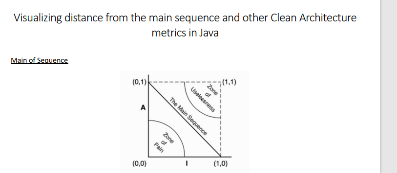
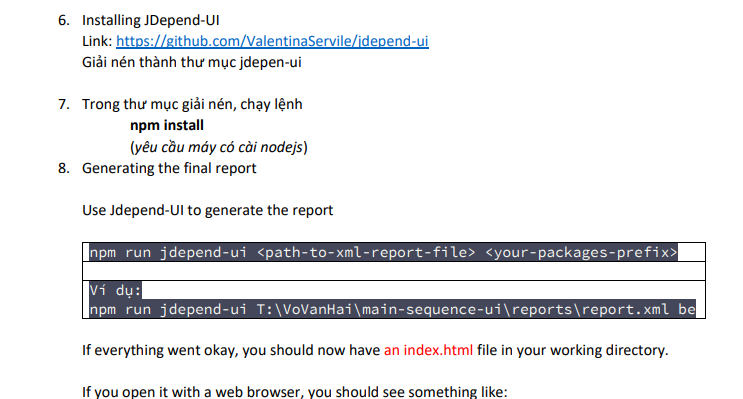
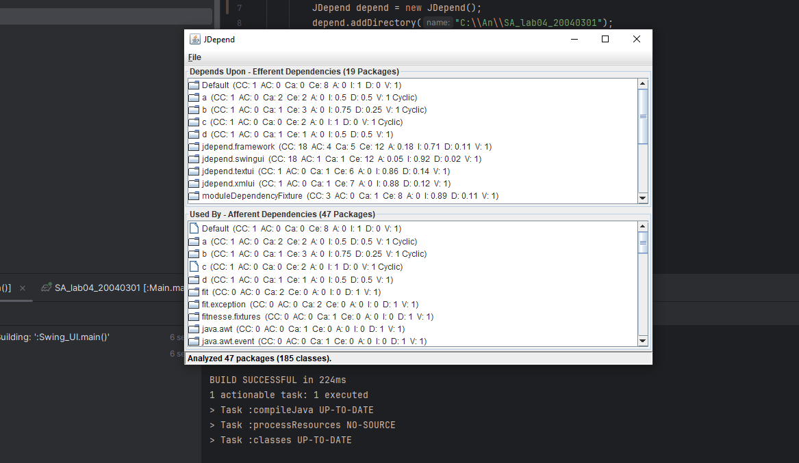
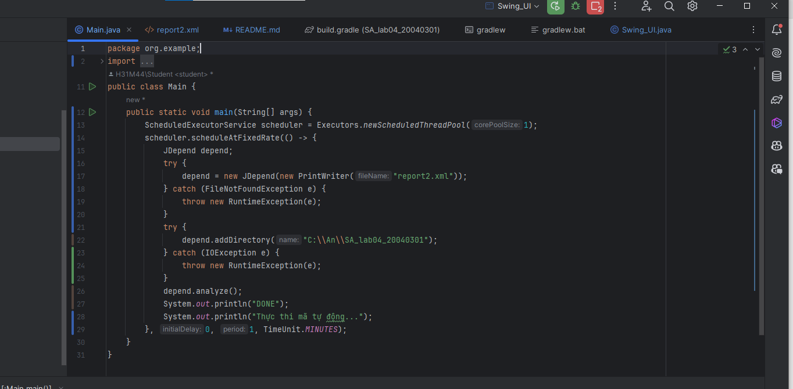
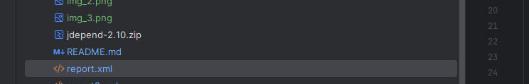
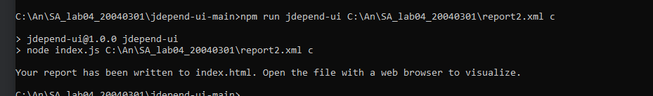
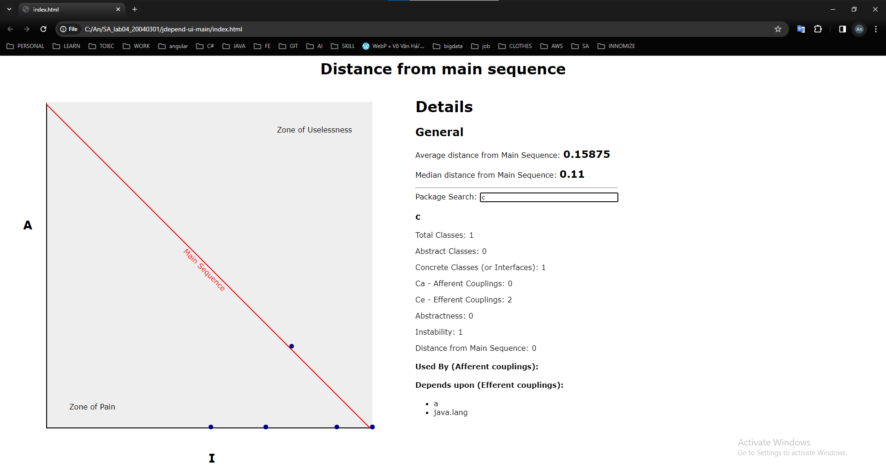
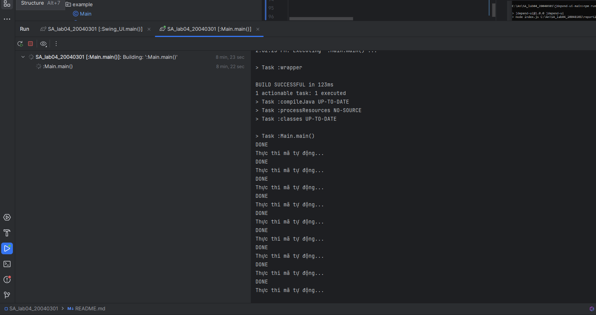
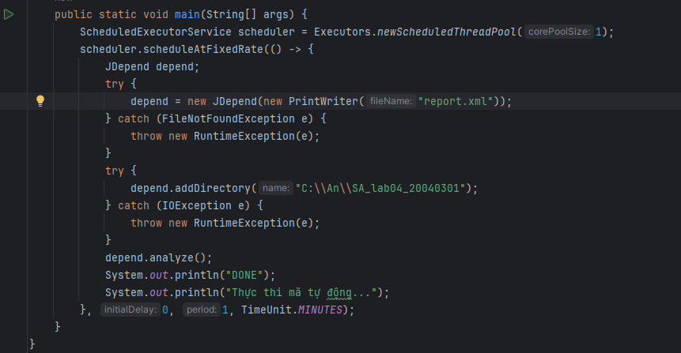

# Lab 04 - Kiến trúc và Thiết Kế Phần Mềm

## Yêu cầu đề bài 



## Các bước thực hiện

Dự án này sử dụng thư viện JDepend và JDependUI để đo lường sự phụ thuộc và cân đối trong mã nguồn Java, giúp visual hóa khoảng cách từ chuỗi chính và các metric Clean Architecture.

Bước 1: Phân tích project bằng JDepend:

Sử dụng thư viện JDepend để phân tích project Java và thu thập thông tin về các phụ thuộc giữa các gói trong dự án.

Sử dụng JDepend để tạo các tập tin XML chứa thông tin về các phụ thuộc này.

Bước 2: Sử dụng JDepend để phân tich thông tin phụ thuộc:

Sử dụng JDepend để phân tích thông tin phụ thuộc giữa các gói trong dự án.

Bước 3: Hiển thị thông tin phụ thuộc:

Có thể dùng Java Swing để hiển thị Ui hoặc dùng xmlui để xuất ra một file report

Bước 4: Sử dụng Jdepend-UI để tạo ra final report

Ta cần cài đặt thư viện Jdenpend-UI và làm theo các yêu cầu sau : 



Link download : https://github.com/ValentinaServile/jdepend-ui

Bước 5: Chạy chương trình và xem kết quả

Mở file index.html trong thư mục Jdepend-UI vừa download để xem thông tin final report

### Công Cụ và Thư Viện

- **JDepend** (https://github.com/clarkware/jdepend): Đây là thư viện JDepend, một công cụ phân tích mã nguồn Java để đo lường chất lượng mã, phụ thuộc và sự phức tạp của mã nguồn.

Ỏ đây dùng thư viện jdepend-2.10.jar, Có thể tải ở đây : https://github.com/clarkware/jdepend/tree/master/dist

Vào thư mục con lib của thư mục vừa giải nén ta được tập tin jdepend-2.10.jar.

- **JDepend-UI** (https://github.com/ValentinaServile/jdepend-ui): Đây là công cụ dùng để hiển thị kết quả phân tích từ file report .xml lên thành 1 trang web mô hình hóa để hiển thị kết quả phân tích

- **file tree** : Dùng để đọc các file jar vào dự án

- **Java Swing** : Dùng để hiển thị UI 

Thêm các phụ thuộc sau vào tệp cấu hình của dự án:

```groovy
    implementation fileTree(dir: 'libs', include: ['*.jar'])
```
## Demo chương trình 

Sau khi download chương trình.Mở nó trong IDE ( recommend: Intellij)

Thưc hiện chạy ứng dụng ở file Swing_UI.java

Sau khi chạy Swing_UI.java,sẽ Hiển thị các thông tin phân tích từ jDepend lên GUI



Thưc hiện chạy ứng dụng ở file Main.java



Sau khi chạy Main.java, sẽ xuất ra file report.xml



Sau khi xuất ra file report.xml, trong thư mục jdepend-ui-main mở terminal, chạy lệnh

npm install 

Bạn cần có nodejs( tham khảo tải tại đây: https://nodejs.org/en)

Sau đó, chạy lên : npm run jdepend-ui <path-to-xml-report-file> <your-packages-prefix>

VD: npm run jdepend-ui C:\An\SA_lab04_20040301\report2.xml c

Sau khi chạy lệnh thành công thì bạn có thể thấy được một thông báo 



Mở file index.html trong thư mục jdepend-ui-main để xem thông tin final report



bên cạnh đó project sẽ tự động chạy lại sau một phút 



Phần code cho việc tự động chạy mã




